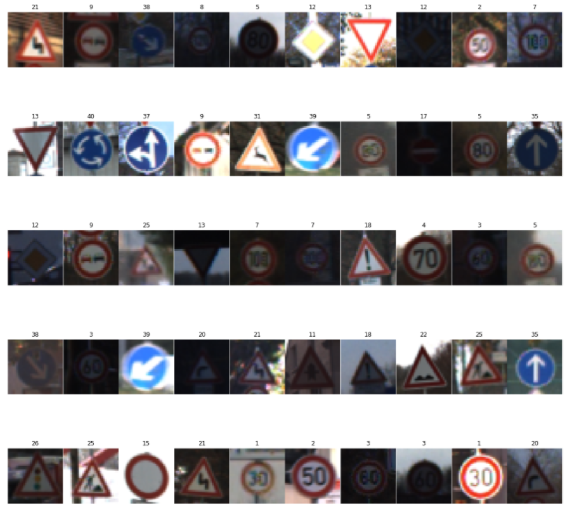
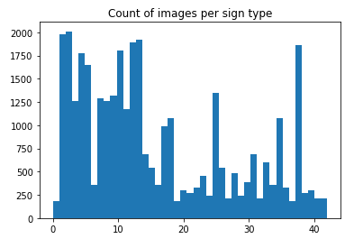
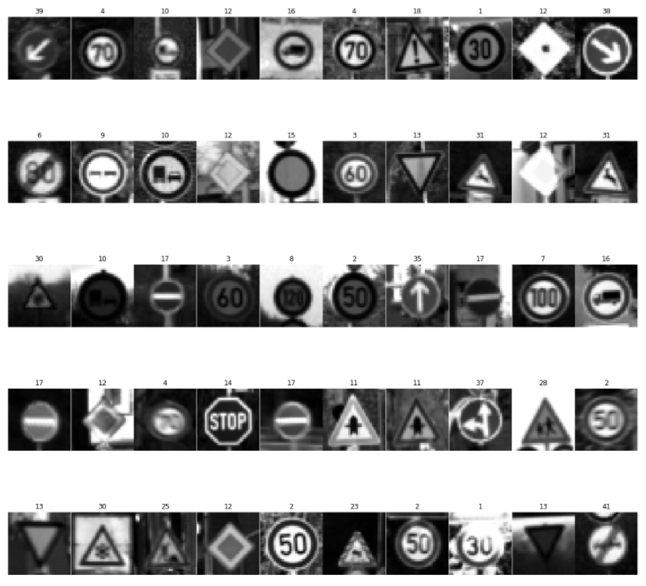
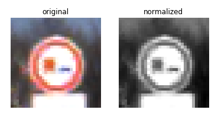

Traffic Sign Recognition
========================

Author: Brian Fischer

Term: February 2017

Code: <https://github.com/brianafischer/CarND-Traffic-Sign-Classifier-Project>

### Data Set Summary & Exploration

#### 1. Provide a basic summary of the data set. In the code, the analysis should be done using python, numpy and/or pandas methods rather than hardcoding results manually.

I used the numpy library to calculate summary statistics of the traffic signs
data set:

Number of training examples = 34799

Number of validation examples= 4410

Number of testing examples = 12630

Image data shape = (32, 32, 3)

Number of classes = 43

#### 2. Include an exploratory visualization of the dataset.

I used matplotlib.pylot to view random images from the data set:

It was important to note the distribution of training images per traffic sign
type. It should be noted this is not an even distribution.

### Design and Test a Model Architecture

#### 1. Describe how you preprocessed the image data. What techniques were chosen and why did you choose these techniques? Consider including images showing the output of each preprocessing technique. Pre-processing refers to techniques such as converting to grayscale, normalization, etc. (OPTIONAL: As described in the "Stand Out Suggestions" part of the rubric, if you generated additional data for training, describe why you decided to generate additional data, how you generated the data, and provide example images of the additional data. Then describe the characteristics of the augmented training set like number of images in the set, number of images for each class, etc.)

Based upon the article “Traffic Sign Recognition with Multi-Scale Convolutional
Networks” by Pierre Sermanet and Yann LeCun, I decided to convert the images to
grayscale

Below are some images after grayscale conversion:

Finally, the data was normalized for proper feature detection and numerical
stability.

Here is an image before and after normalization:

#### 2. Describe what your final model architecture looks like including model type, layers, layer sizes, connectivity, etc.) Consider including a diagram and/or table describing the final model.

My final model consisted of the standard LeNet-5 Solution which has the
following layers:

| **Layer**       | **Description**                            |
|-----------------|--------------------------------------------|
| Input           | 32x32x1 Grayscale image                    |
| Convolution 5x5 | 1x1 stride, valid padding, outputs 28x28x6 |
| RELU            |                                            |
| Max pooling     | 2x2 stride, outputs 14x14x6                |
| Convolution 5x5 | 1x1 stride, valid padding, output 10x10x16 |
| RELU            |                                            |
| Max Pooling     | 2x2 stride, output 5x5x16                  |
| Flatten         | Output 400                                 |
| Fully Connected | Output 120                                 |
| RELU            |                                            |
| Fully Connected | Output 84                                  |
| RELU            |                                            |
| Fully Connected | Output 43                                  |

#### 3. Describe how you trained your model. The discussion can include the type of optimizer, the batch size, number of epochs and any hyperparameters such as learning rate.

To train the model, I started with decreasing the learning rate to 0.0008. The
Adam Optimizer was used. Using a decreased BATCH_SIZE demonstrated faster
learning per EPOCH. After about 70 EPOCHS, the network accuracy topped out above
93%.

#### 4. Describe the approach taken for finding a solution and getting the validation set accuracy to be at least 0.93. Include in the discussion the results on the training, validation and test sets and where in the code these were calculated. Your approach may have been an iterative process, in which case, outline the steps you took to get to the final solution and why you chose those steps. Perhaps your solution involved an already well known implementation or architecture. In this case, discuss why you think the architecture is suitable for the current problem.

My final model results were:

Validation Accuracy = 0.951

Test Accuracy = 0.907

The solution used a LeNet-5 architecture that was well suited for traffic sign
recognition. Given normalized grayscale image data, the network only required
some minor adjustments to the learning rate, batch size, and epochs.

The accuracy on validation, test, and web images were quite good. In addition,
the grayscale images could run well without a GPU.

### Test a Model on New Images

#### 1. Choose five German traffic signs found on the web and provide them in the report. For each image, discuss what quality or qualities might be difficult to classify.

Here are five German traffic signs that I found on the web:

#### [./media/image5.png](./media/image5.png)

#### 2. Discuss the model's predictions on these new traffic signs and compare the results to predicting on the test set. At a minimum, discuss what the predictions were, the accuracy on these new predictions, and compare the accuracy to the accuracy on the test set (OPTIONAL: Discuss the results in more detail as described in the "Stand Out Suggestions" part of the rubric).

Here are the results of the prediction:

| **Image**                             | **Prediction**                        |
|---------------------------------------|---------------------------------------|
| Yield                                 | Yield                                 |
| Stop                                  | Speed Limit (30km/h)                  |
| Speed limit (70km/h)                  | Speed limit (70km/h)                  |
| Right-of-way at the next intersection | Right-of-way at the next intersection |
| General caution                       | General caution                       |

The model was able to correctly guess 4 of the 5 traffic signs, which gives an
accuracy of 80%. I believe that the distribution of Speed Limit (30km/h) signs
was much higher than stop signs in the training set.

#### 3. Describe how certain the model is when predicting on each of the five new images by looking at the softmax probabilities for each prediction. Provide the top 5 softmax probabilities for each image along with the sign type of each probability. (OPTIONAL: as described in the "Stand Out Suggestions" part of the rubric, visualizations can also be provided such as bar charts)

The softmax probabilities returned very confident results (Nearly all 100%) even
though one of the classifications was incorrect:

| **Top Softmax (%)** | **Class ID Predicted** | **Class Name**                        |
|---------------------|------------------------|---------------------------------------|
| 100%                | 13                     | Yield                                 |
| 100%                | 1                      | Speed limit (30km/h)                  |
| 99.98%              | 4                      | Speed limit (70km/h)                  |
| 100%                | 11                     | Right-of-way at the next intersection |
| 100%                | 18                     | General caution                       |
